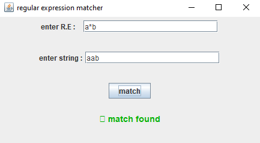
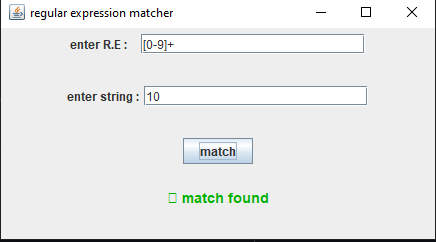
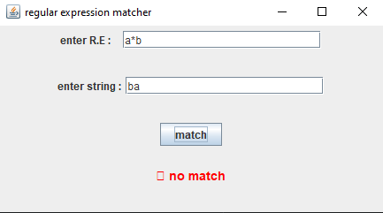
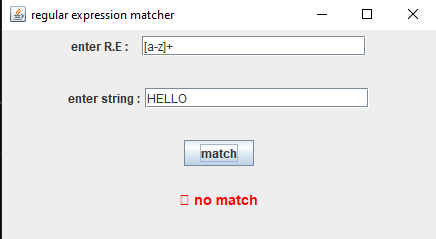

# 📌 Regular Expression Matcher (Java Swing)

A simple desktop application built using **Java Swing** that allows users to test whether a given string matches a specified **Regular Expression (R.E.)**.

This project demonstrates practical implementation of **Automata Theory** concepts using Java's built-in `Pattern` and `Matcher` classes.

---

## 🚀 Features

* 📝 Input custom Regular Expression
* 🔤 Input test string
* ✅ Displays whether the string matches the pattern
* 🎨 Color-coded result:

  * Green → Match Found
  * Red → No Match
  * Orange → Invalid Regular Expression
* 🖥️ Simple and clean GUI

---

## 🛠️ Technologies Used

* **Java**
* **Java Swing (GUI)**
* **java.util.regex.Pattern**
* **java.util.regex.Matcher**
* **Event Handling (ActionListener)**

---

## 🧠 How It Works

1. User enters a Regular Expression.
2. User enters a test string.
3. On clicking **Match**:

   * The program compiles the regex using `Pattern.compile()`
   * Creates a `Matcher` object
   * Uses `matches()` method to check full string match
4. Displays result accordingly.

---

## 📂 Project Structure

```
Regular-Expression-Matcher-Automata-Java-Project/
 └── Automata.java
```

Main Class:

```java
public class Automata extends JFrame
```

Core Method:

```java
private void performmatching()
```

---

## ▶️ How to Run

1. Open in any Java IDE (IntelliJ, Eclipse, NetBeans)
2. Compile and run `Automata.java`
3. Enter:

   * Regular Expression
   * Input String
4. Click **Match**

---

## 📚 Concepts Implemented

* Regular Expressions
* Pattern Matching
* DFA/NFA Concept (Theoretical Background)
* GUI Development with Swing
* Exception Handling

---

## 💡 Example Inputs

| Regular Expression | Input String | Result   |
| ------------------ | ------------ | -------- |
| `a*b`              | `aaab`       | Match    |
| `[0-9]+`           | `12345`      | Match    |
| `[a-z]+`           | `HELLO`      | No Match |

---

## 🎯 Learning Outcome

This project helps in understanding:

* Practical use of Regular Expressions
* Automata Theory application
* String pattern validation
* GUI-based Java application development

---

## 📸 Application Screenshots

<p align="center">
  
  
</p>

<p align="center">
  
  
</p>

---

## 🔮 Future Improvements

* Add support for partial match (`find()` method)
* Display matched groups
* Add regex examples dropdown
* Add syntax helper
* Convert into web-based version

---

## 👨‍💻 Author

**Kashif Raza**
